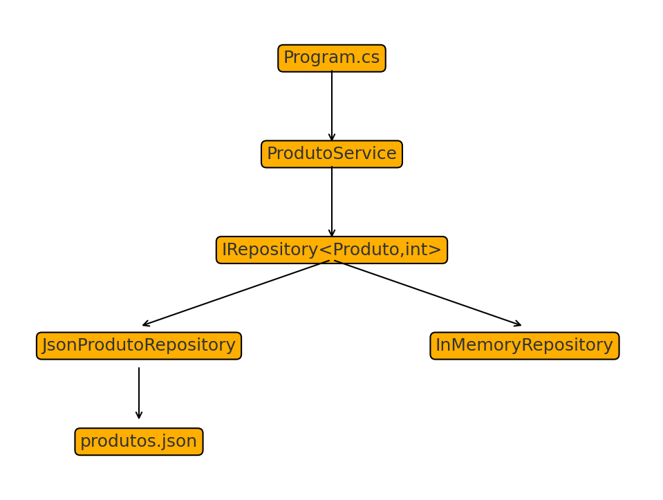

# 🧩 FASE 07 — Repository JSON
### Persistência em arquivo JSON usando System.Text.Json

---

# 🎯 Objetivo

A Fase 07 evolui o projeto para uma nova implementação de persistência usando **JSON**, mantendo:

- O mesmo contrato `IRepository<T, TId>`
- Compatibilidade total com ProdutoService e seletores
- Leitura e escrita com System.Text.Json
- Arquivo `produtos.json` como fonte de dados
- Testes unitários completos manipulando arquivos temporários

O domínio não muda — somente a infraestrutura.

---

# 🧱 Estrutura da Fase 07

```
fase-07-Repository-Json/
│
├── Domain.App/
│   ├── Program.cs
│   └── produtos.json
│
├── Domain.Entities/
│   ├── Models/Produto.cs
│   ├── Repository/
│   │   ├── IRepository.cs
│   │   ├── InMemoryRepository.cs
│   │   └── JsonProdutoRepository.cs
│   ├── Seletores/
│   └── Service/ProdutoService.cs
│
├── Domain.Tests/
│   ├── JsonProdutoRepositoryTests.cs
│   ├── ProdutoRepositoryTests.cs
│   ├── ProdutoServiceSelecaoTests.cs
│   ├── ProdutoServiceTests.cs
│   ├── SeletorEconomicoTests.cs
│   ├── SeletorFactoryTests.cs
│   ├── SeletorPremiumTests.cs
│   └── SeletorQualidadeTests.cs
│
└── docs/DESCRICAO.md
```

---

# 🧠 Repositório JSON

O `JsonProdutoRepository` implementa:

- Salvamento indentado
- camelCase
- ignore nulls
- suporte a arquivo inexistente
- suporte a arquivo vazio
- tratamento de arquivo corrompido
- leitura e escrita segura

---

# 📄 Arquitetura (Diagrama)

Abaixo está o diagrama gerado automaticamente:



---

# 🧪 Testes da Fase 07

A Fase 07 inclui testes obrigatórios:

- Arquivo inexistente  
- Arquivo vazio  
- Inserção e persistência  
- Busca por ID  
- Atualização  
- Remoção  
- Strings complexas  
- Integração com ProdutoService  
- Uso de arquivos temporários (isolamento total)

---

# ✔️ Conclusão

A Fase 07 introduz persistência real em JSON, mantendo baixo acoplamento e permitindo troca futura por banco de dados real sem alterar o domínio.

